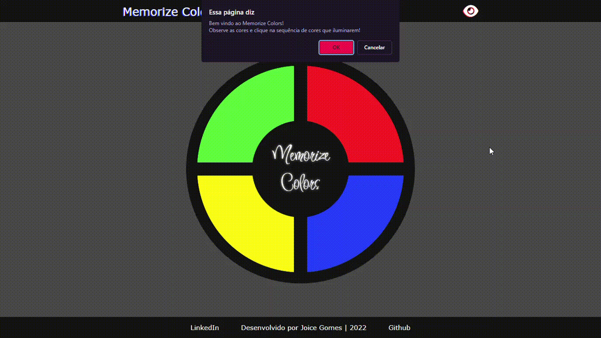
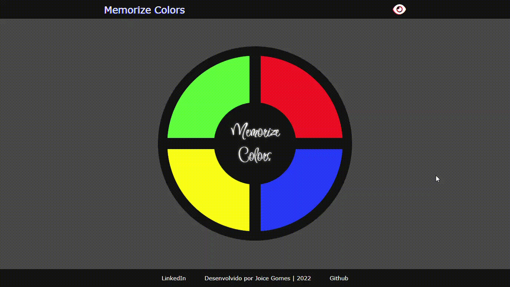

# Memorize Colors | Desafio criando seu jogo da memória estilo Genius

Projeto desenvolvido para o desafio criando seu jogo da memória estilo Genius.

O jogo foi desenvolvido com HTML, CSS e JavaScript e pode ser acessado por um navegador de internet.

## Acessibilidade

No jogo também está inclusa uma função de acessibilidade para daltônicos.

# Acesse o jogo clicando [aqui](https://joi-gn.github.io/MEMORIZECOLORS-game-geniustyle/)